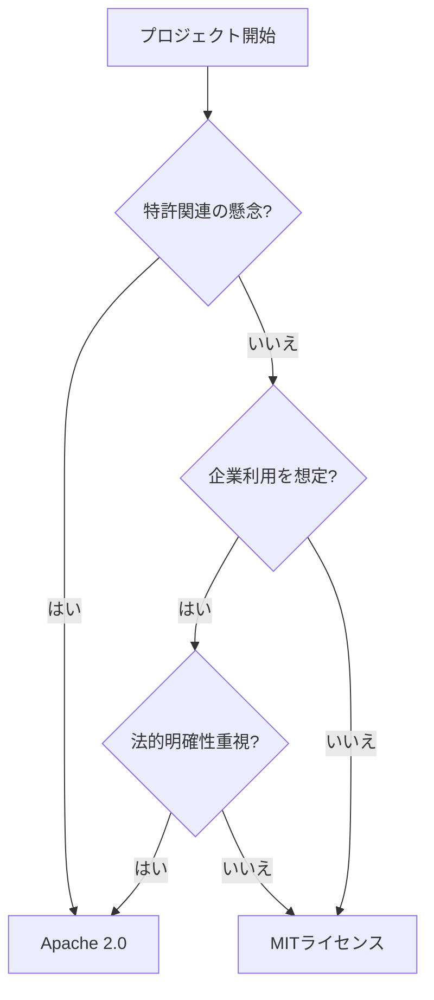

# MITライセンスとApache 2.0ライセンスの違いと使い分け - 実践的な選択ガイド

皆さん、オープンソースソフトウェア（OSS）のライセンス選択で悩んだことはありませんか？特に、MITライセンスとApache 2.0ライセンスは、最も広く使用されているパーミッシブ（許容的）なライセンスですが、その違いと適切な使い分けについて迷うことが多いのではないでしょうか。

私は10年以上、様々なOSSプロジェクトの開発と運用に携わってきました。その経験から、ライセンス選択が開発者とユーザーの双方に大きな影響を与えることを実感しています。この記事では、MITライセンスとApache 2.0ライセンスの違いを実践的な観点から解説し、プロジェクトに適したライセンスを選択するためのガイドラインを提供します。

## 対象読者

- OSSプロジェクトを立ち上げようとしている開発者
- 既存のOSSプロジェクトのライセンスを見直したい方
- OSSライセンスの違いについて理解を深めたい方
- 商用プロジェクトでのOSS活用を検討している方

## 目次

1. [ライセンスの基本概要](#ライセンスの基本概要)
2. [主要な違いの比較](#主要な違いの比較)
3. [使い分けの判断基準](#使い分けの判断基準)
4. [実際のプロジェクトでの採用例](#実際のプロジェクトでの採用例)
5. [選択のための意思決定フローチャート](#選択のための意思決定フローチャート)

## ライセンスの基本概要

### MITライセンス
MITライセンスは、マサチューセッツ工科大学（MIT）で開発された極めてシンプルなライセンスです。

:::message
**MITライセンスの主な特徴**
- 非常にシンプルで理解しやすい（約200単語）
- 最小限の制約で最大限の自由を提供
- 著作権表示とライセンス文の保持のみを要求
:::

### Apache 2.0ライセンス
Apache 2.0ライセンスは、Apache Software Foundationによって作成された、より包括的なライセンスです。

:::message
**Apache 2.0ライセンスの主な特徴**
- より詳細な法的保護を提供（約2,000単語）
- 明示的な特許ライセンスの付与
- 変更箇所の明示要求
- 特許報復条項の存在
:::

## 主要な違いの比較

以下の表で、両ライセンスの主要な違いを比較します：

| 特徴 | MITライセンス | Apache 2.0ライセンス |
|------|--------------|-------------------|
| 長さと複雑さ | 短く簡潔 | より長く詳細 |
| 特許条項 | 明示的な言及なし | 明示的な特許ライセンスを含む |
| 変更の明示 | 特に要求なし | 重要な変更の明示を要求 |
| 商用利用 | 可能 | 可能 |
| 再配布 | 可能 | 可能 |
| 追加の要件 | 最小限 | NOTICEファイルの保持など |

### 特に重要な違い：特許に関する取り扱い

:::details 特許に関する詳細な違い
1. **MITライセンス**
   - 特許に関する明示的な言及なし
   - 黙示的な特許ライセンスの可能性（法的解釈に依存）
   - 特許関連の紛争に対する保護が限定的

2. **Apache 2.0ライセンス**
   - 明示的な特許ライセンスの付与
   - 特許報復条項による保護
   - 特許訴訟時のライセンス終了条項
:::

## 使い分けの判断基準

### MITライセンスが適している場合

- 小規模な個人プロジェクト
- シンプルさと採用のしやすさを重視
- 特許関連の懸念が少ない
- 最大限の自由度を提供したい

### Apache 2.0ライセンスが適している場合

- 大規模な企業プロジェクト
- 特許保護が重要
- 法的な明確性を重視
- 企業からの貢献を期待

## 実際のプロジェクトでの採用例

### MITライセンス採用プロジェクト
- React
- Vue.js
- Angular
- Node.js
- Ruby on Rails

### Apache 2.0ライセンス採用プロジェクト
- Kubernetes
- Android
- Tensorflow
- Apache HTTP Server
- Kafka

## 選択のための意思決定フローチャート

## 実践的な選択ガイドライン

以下の質問に答えることで、適切なライセンスを選択できます：

1. プロジェクトの規模は？
   - 小規模 → MIT
   - 大規模 → Apache 2.0

2. 特許関連の懸念は？
   - あり → Apache 2.0
   - なし → MIT

3. 主なターゲットユーザーは？
   - 個人開発者 → MIT
   - 企業 → Apache 2.0

4. 法的明確性の重要度は？
   - 高い → Apache 2.0
   - 低い → MIT

:::message alert
ライセンスの選択は、プロジェクトの将来に大きな影響を与える可能性があります。不確かな場合は、法務の専門家に相談することをお勧めします。
:::

## まとめ

MITライセンスとApache 2.0ライセンス、それぞれに適した使用場面があります：

- **MITライセンス**: シンプルさと採用のしやすさを重視する場合
- **Apache 2.0ライセンス**: 法的保護と特許関連の明確性を重視する場合

プロジェクトの性質、規模、想定されるユーザー、法的リスクなどを総合的に判断して、適切なライセンスを選択することが重要です。

## 参考資料

- [Open Source Initiative](https://opensource.org/)
- [Choose a License](https://choosealicense.com/)
- [Apache License 2.0](https://www.apache.org/licenses/LICENSE-2.0)
- [The MIT License](https://opensource.org/licenses/MIT)

---

この記事が、あなたのプロジェクトに適したライセンスを選択する際の参考になれば幸いです。ライセンスの選択は、プロジェクトの成功に大きく影響する重要な決定です。慎重に検討し、必要に応じて専門家に相談することをお勧めします。

## 著者について

10年以上のOSS開発経験を持つソフトウェアエンジニア。複数のオープンソースプロジェクトのメンテナとして活動中。ライセンスと法務関連の知識共有に注力。 